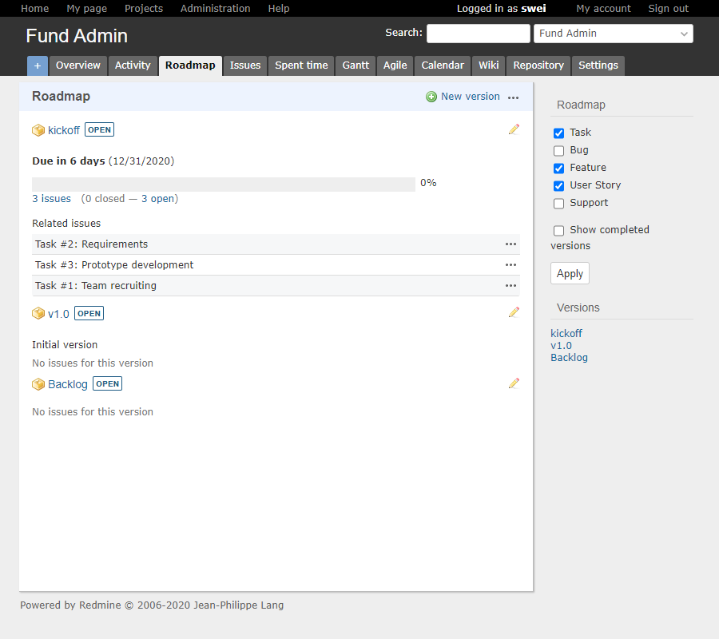

# Redmine Enhanced (v4.x)

Sunding Wei
2020-12-25

## Added features

### Issue Template
- see: [plugins/redmine_mermaid_macro/assets/javascripts/issue-template.js](plugins/redmine_mermaid_macro/assets/javascripts/issue-template.js)

### Theme: 
- basecamp: fix for redmine v4.x

### Plugins: 
- redmine_agile: more Chinese translations
- redmine_gitlab_hook  
- redmine_mermaid_macro
- localizable

### Roadmap:
- custom sorting of versions, base on incrementing versions
- custom sorting of issues, put closed issues to bottom

### Screenshot:

